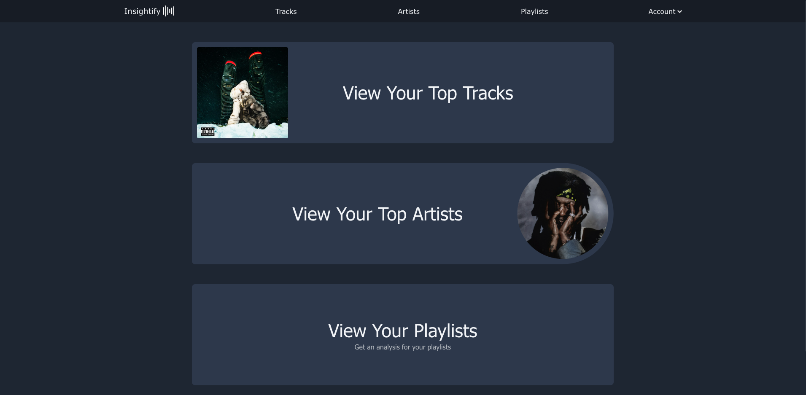
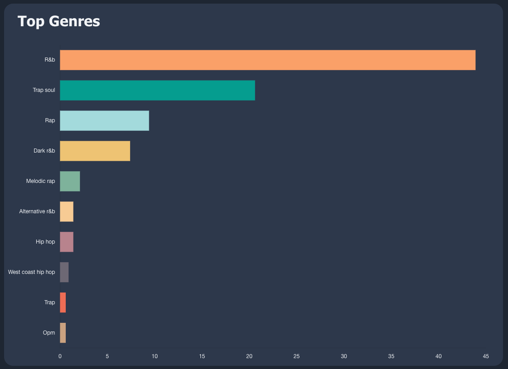

<div align="center">
  

  <p>
    
    
    
    
    
    
    
  </p>
  Discover your music like never before. Track your top artists, explore your playlists, and unlock hidden trends in your listening.
</div>


## Features  🎵
:heavy_check_mark: Explore your top artists and tracks across different time ranges

:heavy_check_mark: Get an in-depth breakdown of your playlists, including top genres, top artists & top albums

:heavy_check_mark: Track how your playlists have evolved over time

:heavy_check_mark: Visualize your playlist breakdown through interactive charts

## Tools & Technologies
💻: **Frontend:** ReactJS 18.2.0

📊 **Visualization Library:** Chart.js 4.4.3

🌐: **Backend:** Spring Boot 3.4.1 (Maven) 

📂: **Database:** PostgreSQL

⚡: **Powered By:** Spotify Web API 


## Home Page


## Top Tracks & Artists Page


## Playlist Breakdown
<p align="center">
    
    
</p>
<p align="center">
    
    
</p>

## Getting Started

### Prerequisites

1. Make sure you have **npm** installed for running the frontend.
2. Make sure you have **Java** and **Maven** for the backend (Spring Boot).
3. Create a Spotify Developer account and set up an application to get your **Spotify API credentials**.

### Installation
1. Clone the repository:
    ```bash
    git clone https://github.com/yourusername/insightify.git
    cd insightify
    ```
2. Install the frontend dependencies:
    ```bash
    cd client
    npm install
    ```

3. Set up environment variables
   - Create a .env file
     
   ```bash
    REACT_APP_CLIENT_ID=
    REACT_APP_CLIENT_SECRET=
    REACT_APP_SCOPE="user-read-private user-read-email user-top-read playlist-read-private user-library-read"
    REACT_APP_REDIRECT_URI=
    REACT_APP_SERVER_URL=
   ```
4. Set up the backend by following these steps:
    - Update the `application.properties` file with your PostgreSQL database details.
    - Add your **Spotify API credentials** to the configuration files.

5. Run the backend (Spring Boot application):
    ```bash
    cd server
    mvn spring-boot:run  
    ```
6. Run the frontend development server:

    ```bash
    cd client
    npm start
    ```

The app will be available at `http://localhost:3000` for the frontend and `http://localhost:8080` for the backend.

## License

This project is licensed under the MIT License - see the [LICENSE](./LICENSE) file for details.
